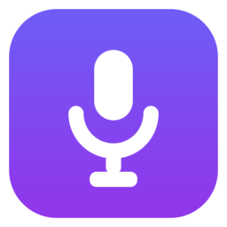

<p align="center">
  
</p>

<h1 align="center">WhisperPress</h1>

<p align="center">
  <b>キーを押しながら話すだけ。文字はカーソルの位置に — どのアプリでも。</b><br/>
  <a href="https://github.com/ggml-org/whisper.cpp">whisper.cpp</a> 駆動、完全オフラインの Windows 用音声入力＆ボイスノート。
</p>

<p align="center">
  <a href="README.zh-Hant.md">繁體中文</a> · <a href="README.md">English</a> · 日本語
</p>

---

## WhisperPress とは？

ホットキー（既定では **F9**）を押しながら話して離すだけ。音声は端末内で文字起こしされ、エディタ・ブラウザ・チャット・ターミナルなど、カーソルがあるアプリにそのまま入力されます。すべての音声入力は検索可能なノートとしても保存されます。

- **100% オフライン。** 音声が PC の外に出ることはありません。アカウント不要、クラウドなし、テレメトリなし。
- **どこでも使える。** 本物のグローバルホットキー＋貼り付け／キー入力エミュレーション — VS Code、Word、Slack、何でも OK。
- **音声入力だけじゃない。** 音声ファイルの取り込み、会議録音（システム音声）、ローカル LLM での要約と Q&A。

## 機能

| | |
|---|---|
| 🎙 **プッシュトゥトーク音声入力** | 押している間だけ録音、軽くタップでロック。トグルモードもあり。 |
| ⌨️ **どのアプリにも入力** | カーソル位置に貼り付け（クリップボードは復元）、または 1 文字ずつ入力。 |
| 📝 **ノート履歴** | すべての音声入力・文字起こしをローカルに保存。検索・編集・コピー。 |
| 📂 **音声ファイル取り込み** | MP3、M4A、WAV、OGG、FLAC など。文字起こし中の逐次表示つき。 |
| 🖥 **会議録音** | システム音声（Teams / Meet / Zoom）＋マイクを録音し、ローカルで文字起こし。 |
| 🌍 **100+ 言語** | Whisper 多言語モデル。自動検出・言語固定・英語への翻訳に対応。 |
| 🈶 **繁体字／簡体字の統一出力** | OpenCC による決定的な変換 — モデル任せにしません。 |
| ✦ **AI 要約 & Q&A** | オプション。任意の OpenAI 互換エンドポイントに対応 — [Ollama](https://ollama.com) ならオフラインのまま。 |
| ⏱ **タイムスタンプ付きエクスポート** | `.txt`、`.md`、`.srt` 字幕として出力。 |
| 🔒 **設計レベルのプライバシー** | モデルは whisper.cpp 経由で CPU/GPU 上で動作。ノートはディスク上のただの JSON。 |
| 🪶 **カスタム語彙** | 初期プロンプトで人名・専門用語・出力スタイルを誘導。 |
| 💻 **ハードウェア自動推奨** | CPU／RAM／NVIDIA GPU を検出し、最適なエンジンとモデルをワンクリックで適用。 |

## ダウンロード

**[Releases ページ](https://github.com/b84330808/whisperpress/releases/latest)** から最新版をどうぞ：

- `WhisperPress-Setup-x.x.x.exe` — インストーラー版(推奨、デスクトップにショートカットを作成)
- `WhisperPress-Portable-x.x.x.exe` — ポータブル版、ダウンロードしてすぐ実行

> 初回実行時に Windows SmartScreen の警告が出ることがあります(バイナリはコード署名されていません)。「**詳細情報**」→「**実行**」をクリックしてください。ソースコードはすべて公開されています — 自分で確認もビルドも可能です。

## はじめかた

### ソースから実行

Windows 10/11 と [Node.js](https://nodejs.org) 20+ が必要です。

```powershell
git clone https://github.com/b84330808/whisperpress.git
cd whisperpress
npm install
npm start
```

初回起動時に whisper.cpp エンジン(約 16 MB、[v1.8.6 公式ビルド](https://github.com/ggml-org/whisper.cpp/releases))と選択したモデルをダウンロードします。以降はすべてオフラインで動作します。

### インストーラーのビルド

```powershell
npm run dist     # NSIS インストーラー + ポータブル exe を release/ に出力
```

## モデル

[Hugging Face（ggerganov/whisper.cpp）](https://huggingface.co/ggerganov/whisper.cpp)から必要に応じてダウンロード：

| モデル | サイズ | 向いている用途 |
|---|---|---|
| tiny / base | 78–148 MB | 高速な下書き |
| small | 488 MB | バランス重視 |
| **large-v3-turbo（q5_0）** | **574 MB** | **おすすめ — 速度と精度のベスト** |
| medium q5_0 / large-v3 q5_0 | 539 MB – 1.1 GB | 最高精度を求める場合 |

NVIDIA GPU をお持ちなら「設定 → 演算方式」を **CUDA** に切り替えると大幅に高速化します。

## ヒント

- **タップでロック**：ホットキーを軽くタップするとハンズフリーで録音継続、もう一度押すと確定。`Esc` でキャンセル。
- **AI 機能**：[Ollama](https://ollama.com) をインストールして `ollama pull qwen3:4b`、設定で AI を有効化（既定の Base URL `http://localhost:11434/v1` のままで OK）。
- **中国語の字形**：「設定 → 文字起こし → 中国語の出力字形」で繁体字／簡体字を保証できます。

## 仕組み

- [Electron](https://electronjs.org) UI。重いフレームワークなし — 素の HTML/CSS/JS。
- [uiohook-napi](https://github.com/SnosMe/uiohook-napi) によるグローバルホットキー（ビルド済み、コンパイラ不要）。
- マイク／システム音声は WebAudio で 16 kHz モノラル取得、WAV にエンコード。
- [whisper.cpp](https://github.com/ggml-org/whisper.cpp) の `whisper-server` を常駐させ音声入力を即応答に。長いファイルは `whisper-cli` でセグメント単位にストリーミング。
- テキスト入力は Win32 `SendInput`（クリップボード復元付きの Ctrl+V 貼り付け、または 1 文字ずつの Unicode 入力）を小さな常駐 PowerShell ヘルパー経由で実行 — ネイティブモジュールのコンパイルは一切不要。
- ノートは `%APPDATA%\WhisperPress\notes` に 1 件 1 JSON ファイル。

## プライバシー

音声はメモリ内で処理され、（任意で）あなたのディスクに**のみ**保存されます。ネットワーク通信はセットアップ時のエンジン／モデルのダウンロードと、AI 機能を有効にした場合に*あなたが*設定したエンドポイントへの送信だけです。

## ロードマップ

- [ ] SenseVoice / Parakeet エンジン（sherpa-onnx）— CJK をさらに高速に
- [ ] リアルタイム音声入力プレビュー
- [ ] VAD による自動停止
- [ ] アプリごとの語彙プロファイル
- [ ] インストーラーのコード署名

## ライセンス

[MIT](LICENSE)
